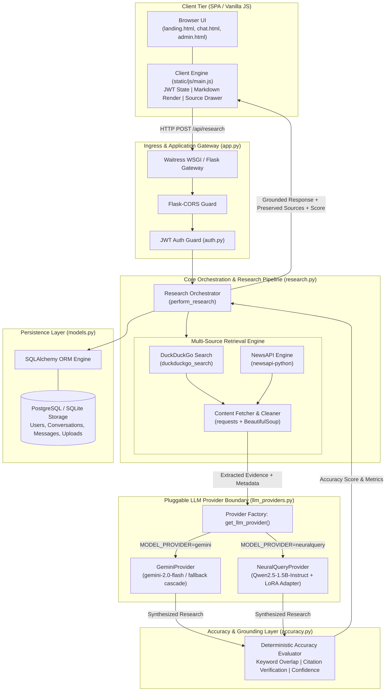
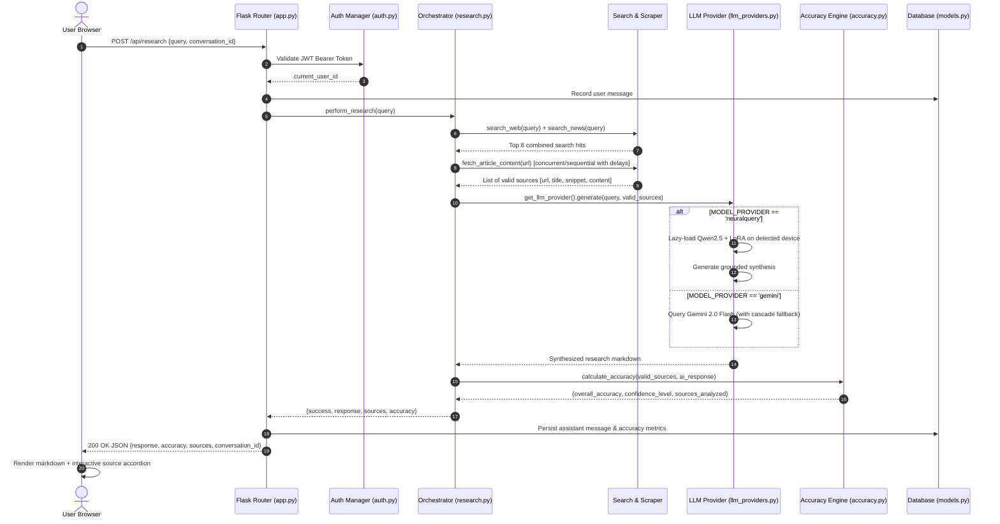
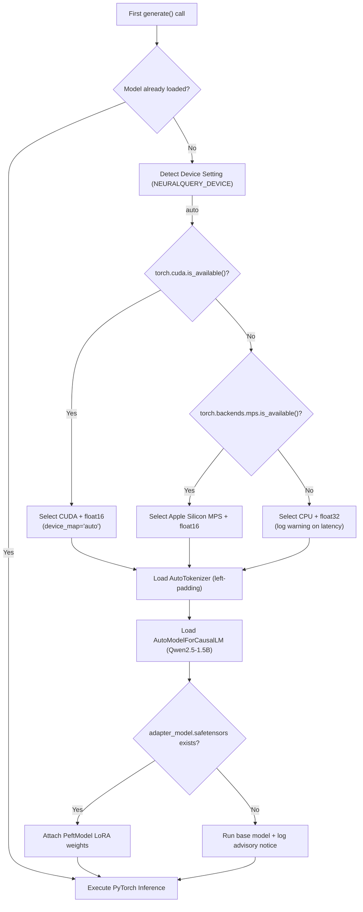

# NeuralQuery Architecture Specification

NeuralQuery is a modular full-stack research intelligence application that pairs real-time web and news retrieval with grounded LLM synthesis. This document details the technical architecture, component boundaries, execution flows, provider abstractions, model loading mechanics, citation preservation, and deployment patterns.

---

## 1. High-Level Architecture Topology

NeuralQuery is structured as a decoupled Modular Monolith:



---

## 2. End-to-End Request Flow

When an authenticated user submits a query from the chat interface, the system executes through the following sequence:



---

## 3. Retrieval Pipeline & Multi-Source Gathering

The retrieval pipeline in [research.py](file:///c:/Users/kesha/OneDrive/Desktop/NeuralQuery/research.py) coordinates two complementary search layers:
1. **DuckDuckGo Search (`search_web`):**
   - Free, legal search API via `duckduckgo_search` library.
   - Requires no API key.
   - Fetches organic web search results with title, URL, and snippet.
   - Incorporates retry logic with jitter sleep to handle temporary network interruptions.
2. **NewsAPI (`search_news`):**
   - When `NEWS_API_KEY` is configured, queries the `get_everything` endpoint for recent news articles.
   - Prioritizes timely reporting for breaking queries and attaches an `is_news: true` flag.

Both result streams are combined (news prioritized for timeliness) and capped at the top 8 candidates for deep extraction.

---

## 4. Web Content Extraction & Evidence Processing

Raw HTML search snippets are often incomplete. The function `fetch_article_content(url)` enhances evidence quality:
- **Polite Crawling:** Applies `Config.REQUEST_DELAY` (1 second) and a descriptive User-Agent header (`NeuralQuery/1.0`).
- **DOM Cleaning:** Removes `<script>`, `<style>`, `<nav>`, `<footer>`, `<header>`, `<aside>`, and `<iframe>` elements using BeautifulSoup.
- **Semantic Heuristics:** Searches for standard content containers (`article`, `main`, `[role="main"]`, `.content`, `.post-content`) before falling back to `<body>`.
- **Text Normalization:** Strips boilerplate, discards one-line navigation links (< 20 characters), and limits body text to the most relevant 2,000 characters to conserve context length.

---

## 5. LLM Provider Abstraction

The LLM abstraction in [llm_providers.py](file:///c:/Users/kesha/OneDrive/Desktop/NeuralQuery/llm_providers.py) decouples research orchestration from the concrete language model:

```python
class BaseLLMProvider(ABC):
    @abstractmethod
    def generate(self, query: str, sources: List[Dict]) -> str:
        """Synthesize response from query and retrieved sources."""
```

The factory `get_llm_provider()` inspects `Config.MODEL_PROVIDER` (`'gemini'` vs `'neuralquery'`) and instantiates the selected provider.

---

## 6. Gemini Provider (`GeminiProvider`)

- **Model Cascade:** Attempts inference against a prioritized sequence of models:
  1. `models/gemini-2.0-flash`
  2. `models/gemini-flash-latest`
  3. `models/gemini-pro-latest`
  4. `models/gemini-2.0-flash-lite-preview`
  5. `models/gemini-1.5-flash-latest`
  6. `models/gemma-3-27b-it`
- **Error Boundaries:** Catches rate-limit (HTTP 429) errors, safety blocks, and network timeouts.
- **Fallback Display:** If API generation fails but sources were retrieved, it formats the raw sources cleanly for the user rather than failing silently.

---

## 7. NeuralQuery Qwen Provider (`NeuralQueryProvider`)

- **Base Architecture:** `Qwen/Qwen2.5-1.5B-Instruct`
- **LoRA Adaptation:** Attaches low-rank weights from `model/neuralquery-production-adapter/`.
- **Prompt Structure:** Strictly bifurcates the prompt:
  ```
  Research Question:
  <query>

  Retrieved Evidence:
  [Source 1]: <title>
  URL: <url>
  Evidence Content:
  <content>
  ```
- **Grounding Operational Constraints:** Instructs the model to:
  - Base answers strictly on retrieved evidence.
  - Explicitly refuse unsupported claims when facts are absent.
  - Highlight discrepancies between conflicting sources.
  - Filter irrelevant web noise.
  - Express calibrated uncertainty for preliminary or partial evidence.

---

## 8. Lazy Loading & Device Detection

The custom LLM is loaded **lazily on the first invocation** of `generate()`, preventing unnecessary memory consumption when running with Gemini:



---

## 9. Citation & Source Preservation

Preserving verifiable source citations is fundamental to NeuralQuery's design:
1. **Metadata Retention:** Original source URLs, titles, snippets, and publishing metadata are retained in the `valid_sources` list within `research.py`.
2. **Attribution Tags:** The prompt assigns indexed identifiers (`[Source 1]`, `[Source 2]`) to each evidence block. The LLM references these markers in its text.
3. **No Hallucinated URLs:** The system instructions explicitly forbid the LLM from inventing URLs.
4. **Interactive UI Drawer:** The frontend renders an interactive accordion (`main.js: addMessage`) populated with the verified source URLs and titles returned directly from the backend JSON payload.

---

## 10. Accuracy & Confidence Heuristics Layer

The deterministic evaluation engine in [accuracy.py](file:///c:/Users/kesha/OneDrive/Desktop/NeuralQuery/accuracy.py) calculates grounded confidence metrics without secondary LLM calls:
1. **Keyword Overlap Score:** Measures the intersection of significant vocabulary (length $\ge 4$ characters) between source evidence and the generated synthesis.
2. **Citation Check Score:** Verifies that source titles or URLs appear in the generated synthesis.
3. **Composite Metric:**
   $$\text{Overall Accuracy} = \text{clamp}(60, 98, (0.6 \times \text{Overlap}) + (0.4 \times \text{Citation}))$$
4. **Confidence Level Mapping:**
   - $\ge 90\% \rightarrow \textbf{High}$
   - $75\% - 89\% \rightarrow \textbf{Moderate}$
   - $< 75\% \rightarrow \textbf{Low}$

---

## 11. Relational Persistence & Authentication

- **Database Engine:** SQLAlchemy ORM with PostgreSQL (production) or SQLite (local testing).
- **Core Entities:**
  - `User`: Email index, bcrypt salted hash (`bcrypt.gensalt(12)`), timestamps.
  - `Conversation`: User foreign key, auto-generated title from initial research prompt.
  - `Message`: Linked to conversation, stores role (`user` vs `assistant`), response content, accuracy score, and sources count.
  - `UploadedFile`: User document attachments (PDF, DOCX, TXT) with secure filename sanitation and MIME validation.
- **Authentication:** Stateless HS256 JWT tokens with 24-hour expiration, passed in the `Authorization: Bearer <token>` header and validated via the `@require_auth` decorator.

---

## 12. Deployment Considerations

| Component | Minimum Requirements | Recommended Production Spec |
|---|---|---|
| **Gemini Provider** | 1 vCPU, 512MB RAM | 1 vCPU, 1GB RAM (Render Free/Starter tier) |
| **NeuralQuery Provider (GPU)** | 4 vCPU, 8GB RAM, 1x NVIDIA T4 (16GB VRAM) | 4 vCPU, 16GB RAM, NVIDIA A10G or T4 GPU |
| **NeuralQuery Provider (CPU)** | 4 vCPU, 8GB System RAM | 8 vCPU, 16GB System RAM (AVX2 support) |
| **Database** | PostgreSQL 14+ | PostgreSQL 16 Managed DB |
| **WSGI Server** | Waitress (included) / Gunicorn | Waitress multi-threaded WSGI |
