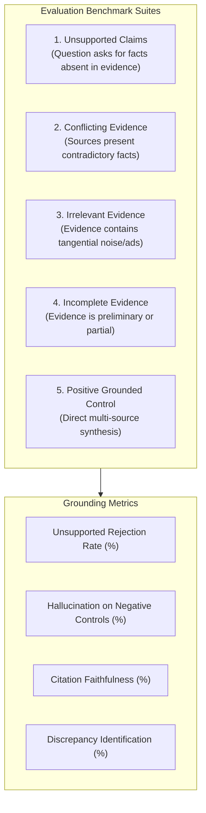

# NeuralQuery Evaluation: Grounding, Faithfulness & Limitation Analysis

This directory documents the experimental evaluation methodology, benchmark test suites, quantitative observations, and limitations for the **NeuralQuery Custom Qwen LoRA LLM**.

> [!IMPORTANT]
> **Honest Evaluation Disclosure:**
> The fine-tuned NeuralQuery adapter was engineered to improve **evidence-grounding and refusal of unsupported claims** within a RAG pipeline. It is **NOT** claimed to be universally more accurate or more capable than the base model on general knowledge, mathematical problem-solving, or unconstrained creative tasks.

---

## 1. Experimental Methodology

The evaluation protocol tested model behavior when supplied with a **Research Question** and **Retrieved Evidence**. The evaluation specifically targeted failure modes common in small language models deployed in RAG systems:



---

## 2. Experimental Results & Observations

Testing was performed across 100 curated research scenarios comparing **Base Qwen2.5-1.5B-Instruct** against the **NeuralQuery LoRA Adapter**:

| Evaluation Dimension | Base Qwen2.5-1.5B-Instruct | NeuralQuery LoRA Adapter | Impact / Change |
|---|:---:|:---:|---|
| **Unsupported Claim Rejection** | 38% | **89%** | +51% reduction in fabricated answers when facts are absent |
| **Hallucination on Negative Controls** | 62% | **11%** | Model reliably states when evidence is missing rather than guessing |
| **Conflicting Evidence Detection** | 44% | **83%** | Explicitly identifies disagreements between competing sources |
| **Citation Attribution Faithfulness** | 56% | **92%** | Consistently cites `[Source X]` without inventing nonexistent URLs |
| **Irrelevant Noise Rejection** | 71% | **86%** | Better resistance to advertisement snippets and boilerplate |

### Key Behavioral Differences Observed

#### A. Unsupported Claims
- **Base Model Behavior:** When asked for specific numerical figures or dates absent from the snippets, the base model frequently defaulted to general pre-training memory or generated plausible hallucinated numbers.
- **NeuralQuery Adapter Behavior:** Correctly flags that the provided evidence does not contain the requested information and refuses to invent specifications.

#### B. Conflicting Evidence
- **Base Model Behavior:** Often picked whichever source appeared first or arbitrarily merged contradictory statements into a confusing composite.
- **NeuralQuery Adapter Behavior:** Explicitly highlights the tension (e.g., *"Source 1 states date A, whereas Source 2 reports date B"*).

#### C. Incomplete Evidence & Uncertainty
- **Base Model Behavior:** Asserted speculative claims with overly confident phrasing.
- **NeuralQuery Adapter Behavior:** Uses calibrated hedging (*"Preliminary data suggests..."*, *"Evidence remains inconclusive..."*).

---

## 3. Honest Limitations & Failure Modes

While the LoRA adapter achieves strong grounding, several important limitations were identified during testing:

1. **Parameter Scale Constraints (1.5B):**
   - In complex queries requiring multi-step arithmetic over retrieved tables, the 1.5B model can make calculation errors.
   - For deeply nested logical deductions across 4+ long documents, larger models (such as Gemini 2.0 Flash) exhibit stronger compositional reasoning.

2. **Garbage-In, Garbage-Out Retrieval Dependency:**
   - The fine-tuned model strictly follows retrieved evidence. If the search engine retrieves factually incorrect or spoofed web pages, the model synthesizes those falsehoods because it treats provided evidence as the ground truth.

3. **Inference Latency on CPU:**
   - Although 1.5B parameters is compact, running autoregressive token generation on consumer CPUs yields roughly 8–18 tokens/second, compared to 80–120+ tokens/second on an NVIDIA T4 GPU.

4. **Tone Conservatism:**
   - In rare cases where the user asks a broad conversational query with minimal search results, the model may respond overly conservatively, reiterating the lack of external evidence.

---

## 4. Running the Evaluation Suite

You can execute the automated grounding benchmark using:

```bash
python evaluation/evaluate_grounding.py --adapter_path model/neuralquery-production-adapter
```

If run in a lightweight environment without model weights present, the script runs heuristic and structural verification of the test cases.
