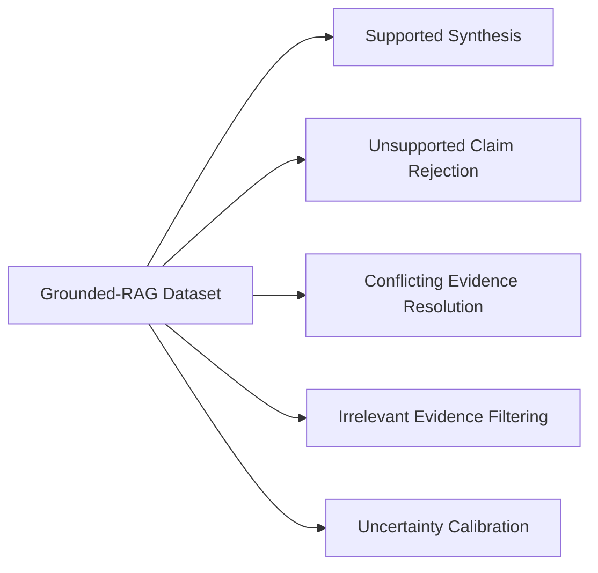

# NeuralQuery Custom LLM Training: Grounded-RAG LoRA Fine-Tuning

This directory documents the fine-tuning methodology, dataset formatting, training hyperparameters, and reproduction pipeline for the **NeuralQuery Custom LLM** adapter.

> [!IMPORTANT]
> **Fine-Tuning Disclosure:**
> The model was fine-tuned from an existing base model (`Qwen/Qwen2.5-1.5B-Instruct`); it was **NOT** trained from scratch. Parameter-Efficient Fine-Tuning (PEFT) via LoRA (Low-Rank Adaptation) was used to adapt the base instruction model specifically for evidence-grounded research synthesis.

---

## 1. Model Architecture & Base Foundation

- **Base Foundation Model:** `Qwen/Qwen2.5-1.5B-Instruct`
  - Developed by the Qwen team (Alibaba Cloud).
  - 1.54 billion parameters, decoder-only causal language model.
  - Native context length up to 131,072 tokens (configured for 2,048–4,096 tokens in NeuralQuery inference).
  - Strong base instruction following and reasoning in multilingual text and code.
- **Adaptation Strategy:** PEFT LoRA (Low-Rank Adaptation)
  - Rather than updating all 1.54 billion weights, low-rank decomposition matrices ($W = W_0 + \Delta W$, where $\Delta W = B \times A$) are injected into the attention projection layers.
  - Trainable parameters: **~9.4 million** (0.6% of total model parameters), keeping the adapter lightweight (~30MB safetensors artifact) and drastically reducing GPU memory requirements.

---

## 2. LoRA Hyperparameter Configuration

The production LoRA adapter was trained with the following hyperparameters (matching `model/neuralquery-production-adapter/adapter_config.json`):

| Parameter | Value | Rationale |
|---|---|---|
| **Base Model** | `Qwen/Qwen2.5-1.5B-Instruct` | Compact, fast inference, high quality instruction following |
| **Task Type** | `CAUSAL_LM` | Autoregressive language modeling |
| **LoRA Rank ($r$)** | `16` | Sufficient expressive capacity for style and grounding constraints without overfitting |
| **LoRA Alpha ($\alpha$)** | `32` | Scaling factor ($\alpha / r = 2.0$) providing balanced gradient updates |
| **LoRA Dropout** | `0.05` | Regularization to prevent memorization of specific training facts |
| **Target Modules** | `["q_proj", "k_proj", "v_proj", "o_proj"]` | All four multi-head self-attention projections are adapted |
| **Quantization** | 4-bit NF4 (BitsAndBytes) | QLoRA configuration for efficient memory usage on Google Colab T4 GPU |

---

## 3. Grounded-RAG Dataset Composition

General-purpose instruction-tuned models frequently suffer from two critical flaws in research pipelines:
1. **Hallucination from Pre-training Memory:** Answering from general memory even when retrieved search results contradict or do not contain the answer.
2. **Failure to Reject Unsupported Claims:** Generating plausible-sounding answers when evidence is missing.

To correct these behaviors, the NeuralQuery fine-tuning dataset was curated around five core evidence-grounding paradigms:



### Dataset Categories

1. **Direct Supported Inferences (40%):**
   - Question paired with clear, multi-source evidence.
   - Target: Coherent synthesis with explicit source attribution (`[Source 1]`, `[Source 2]`).
2. **Unsupported Claim Rejection (20%):**
   - Question asking for details completely absent from the retrieved snippets.
   - Target: Explicit statement that the provided evidence does not support the claim, refusing to invent facts from internal memory.
3. **Conflicting Evidence Resolution (15%):**
   - Sources presenting contradictory dates, numbers, or conclusions.
   - Target: Identifying the divergence, naming the conflicting sources, and avoiding taking a false side.
4. **Irrelevant Noise Filtering (15%):**
   - Search results containing boilerplate, advertisements, or off-topic paragraphs.
   - Target: Filtering irrelevant noise and extracting only pertinent facts.
5. **Incomplete Evidence & Calibrated Uncertainty (10%):**
   - Partial or preliminary information (e.g. ongoing clinical trials, unconfirmed rumors).
   - Target: Clearly phrased uncertainty ("Evidence suggests...", "Preliminary reports indicate...").

---

## 4. Behavioral Training Examples

### Example 1: Unsupported Claim Rejection

**Input:**
```
Research Question:
What were the exact battery capacities in mAh for the 2026 quantum smartwatch prototype?

Retrieved Evidence:
[Source 1]: Quantum Smartwatch Announced - TechDaily
URL: https://techdaily.example/quantum-watch
Evidence Content:
The company announced its prototype smartwatch today featuring a quantum sensor and sapphire glass display. Pricing and release dates will be announced in Q4. No internal battery or component hardware specifications were released.
```

**Target Output:**
```markdown
Based on the retrieved evidence, the exact battery capacity (in mAh) for the prototype is **not available**. 

[Source 1] explicitly states that no battery or component hardware specifications have been released by the manufacturer. Consequently, this information cannot be verified from the provided evidence.
```

### Example 2: Conflicting Evidence Resolution

**Input:**
```
Research Question:
When does the mission launch according to space agency reports?

Retrieved Evidence:
[Source 1]: Orbital Agency Press Release
URL: https://orbital.example/press/launch-schedule
Evidence Content:
Mission control confirmed launch is scheduled for October 14, 2026 from Pad 39A.

[Source 2]: Global Aerospace Gazette
URL: https://aerogazette.example/delays
Evidence Content:
Engine inspection delays have pushed the launch target to November 2, 2026, according to internal engineering memos.
```

**Target Output:**
```markdown
The retrieved sources present conflicting launch dates:

- **October 14, 2026:** The official press release ([Source 1]) states the mission is slated for October 14 from Pad 39A.
- **November 2, 2026:** [Source 2] reports the target has been delayed to November 2 due to engine inspection delays.

The discrepancy indicates an evolving launch schedule.
```

---

## 5. Training Hardware & Hyperparameters

- **Hardware:** Google Colab T4 GPU (16GB VRAM)
- **Frameworks:** PyTorch, Hugging Face `transformers`, `peft`, `bitsandbytes`, `trl`
- **Effective Batch Size:** 16 (Per-device batch size: 2, Gradient accumulation steps: 8)
- **Learning Rate:** 2e-4
- **Learning Rate Scheduler:** Cosine annealing with 5% warmup
- **Optimizer:** Paged AdamW 8-bit (`paged_adamw_8bit`)
- **Precision:** Mixed precision FP16 with 4-bit base weights (NF4)
- **Epochs:** 3
- **Max Sequence Length:** 2,048 tokens

---

## 6. How to Reproduce Training

1. Ensure requirements are installed:
   ```bash
   pip install torch transformers peft accelerate bitsandbytes datasets trl
   ```

2. Run the training script:
   ```bash
   python training/train_neuralquery_lora.py \
       --base_model Qwen/Qwen2.5-1.5B-Instruct \
       --dataset training/dataset_sample.jsonl \
       --output_dir model/neuralquery-production-adapter \
       --epochs 3 \
       --batch_size 2 \
       --learning_rate 2e-4
   ```

3. The script will save `adapter_config.json`, `tokenizer_config.json`, and `adapter_model.safetensors` in the specified output directory.

---

## 7. Known Training Limitations

1. **Parameter Scale (1.5B):** At 1.54 billion parameters, complex multi-step symbolic reasoning, nested arithmetic, and extensive cross-document semantic synthesis are naturally constrained relative to 70B+ parameter models or Gemini 2.0 Flash.
2. **Context Window Boundary:** While Qwen2.5 supports extended context, training with max sequence length 2,048 tokens optimizes memory on T4 GPUs but requires aggressive extraction/truncation of lengthy web pages.
3. **Retrieval Dependency:** The model is intentionally conditioned to rely exclusively on retrieved evidence. If web search returns unhelpful snippets or fails, the model conservatively refuses to answer rather than speculating.
